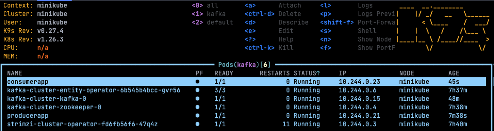
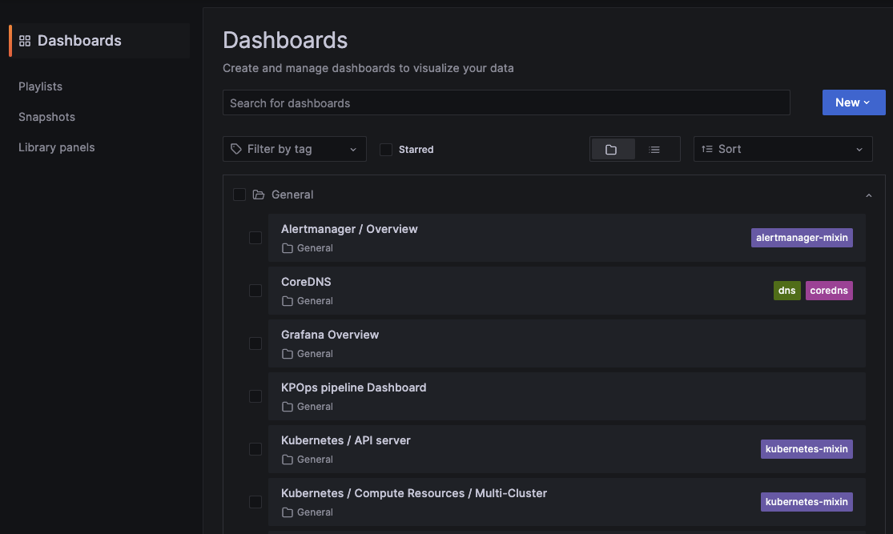
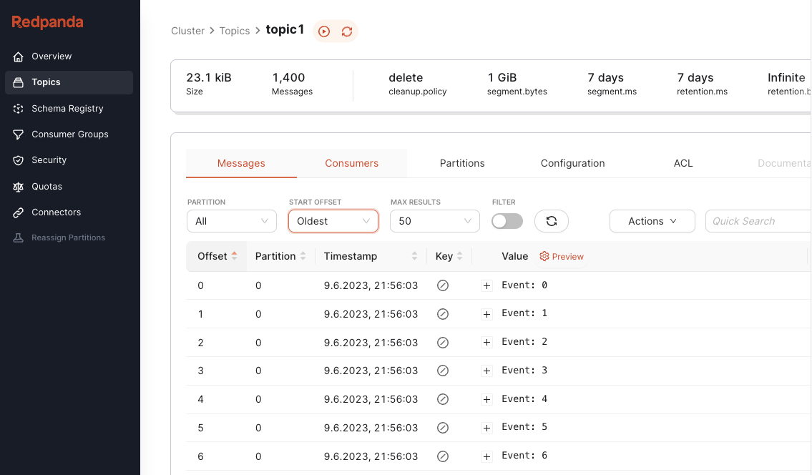

# Basic setup of local k3d cluster

```shell
# navigate to deployment dir
cd deployment

# install k3d
wget -q -O - https://raw.githubusercontent.com/k3d-io/k3d/v5.4.6/install.sh | bash
# or 
brew install k3d # for Mac
choco install k3d # for Windows

# Create cluster
k3d cluster create monitoring --image rancher/k3s

# in case you want to stop/delete the cluster
k3d cluster stop monitoring
k3d cluster delete monitoring
```

# CLI tools
```shell
# install helm and helmfile
brew install helm # for Mac
brew install helmfile
choco install kubernetes-helm # for Windows
choco install helmfile

# install Kubernetes CLI (see https://kubernetes.io/de/docs/tasks/tools/install-kubectl/)
brew install kubernetes-cli # for Mac
choco install kubernetes-cli # for Windows

# install K9s CLI tool (for administrating a Kubernetes cluster, see https://k9scli.io/topics/install/)
brew install derailed/k9s/k9s # for Mac
choco install k9s # for Windows
```

# Deployment of whole stack

##### Kafka, Strimzi-Operator, Prometheus, Prometheus JMX Exporter, Grafana, Redpanda console
```shell
# install whole stack via helmfile (from within `deployment` dir)
helmfile apply
```


# Producer and Consumer

### Create a topic
To create a topic, open a terminal inside the zookeeper pod and create a topic, like:
`bin/kafka-topics.sh --create --topic topic1 --bootstrap-server cluster-kafka-bootstrap.kafka:9092 --partitions 12 --replication-factor 1`

To modify deployments check `deployment/charts/producerapp` or `deployment/charts/consumerapp`. <br>

### Update the version tag each time you make a change!
If you updated the applications in any way, and you want the cluster to use the updated version,
be aware, that you need to update the version tag each time you update one of the applications. 
Otherwise, Kubernetes will not pull the new version from the registry. 

To do so, update the `appversion` in the [producer app chart](deployment/charts/producerapp/Chart.yaml) or
[consumer app chart](deployment/charts/consumerapp/Chart.yaml).
Then, copy the version tag (without the quotation marks), expose the version as variable in your terminal 
and tag the new image with the updated version while building and pushing like in the examples below.

### producerapp
```shell
# Build producer app and push to registry (assuming you are in the projects root dir)
VERSION={VERSION} # replace {VERSION} with the current tag, something like 0.1.1
docker build -t avarange/pj-ds-producer:$VERSION -f ./producerapp/Dockerfile ./producerapp 
docker push avarange/pj-ds-producer:$VERSION
# apply new version to cluster
cd deployment
helmfile apply 
```

### consumerapp
```shell
# Build producer app and push to registry (assuming you are in the projects root dir)
VERSION={VERSION} # replace {VERSION} with the current tag, something like 0.1.1
docker build -t avarange/pj-ds-consumer:$VERSION -f ./consumerapp/Dockerfile ./consumerapp 
docker push avarange/pj-ds-consumer:$VERSION
# apply new version to cluster
cd deployment
helmfile apply
```

# Grafana

To view Grafana under `localhost:3000`, just port-forward the `kube-prometheus-stack-grafana` pod via `k9s`. <br>
Login credentials default to `admin` for username and `prom-operator` for password. <br>
Lots of dashboards already exist. Feel free to change and save under `deployment/charts/kafka-cluster/dashboards`.



# Redpanda concole
Kafka is configured to auto-create topics. For managing and gaining insight of the kafka deployment, you can use the
Redpanda console.
To view the console, just port-forward the `redpanda-console` pod via `k9s` and visit `localhost:8081`.


