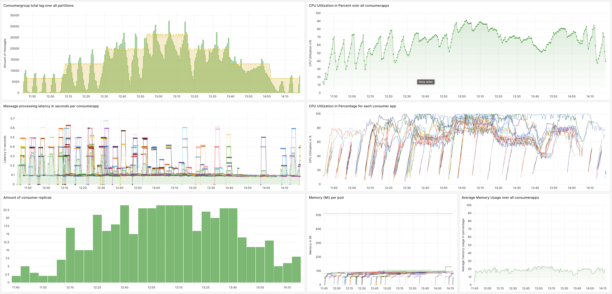

# General Prerequisites

This workflow description assumes you've configured your `gcloud` cli like described [here](SETUP_GCLOUD.md).
```bash
# don't forged to connect gcloud to the project
gcloud config set project pj-distributed-systems-sose23
# or
gcloud config set project pj-ds-sose23-cluster3
# or
gcloud config set project setup-dspj-1
```

### Create a test topic
To create a topic, open a terminal inside the zookeeper pod and create a topic, like:
`bin/kafka-topics.sh --create --topic topic1 --bootstrap-server cluster-kafka-bootstrap.kafka:9092 --partitions 24 --replication-factor 1`
Each time after cluster or VMs have been killed, you need to create the test topic again.
If you increase or lower the max number of replicas, remember to update the partitions.

### Port-forward Grafana (plus Prometheus & Redpanda)

##### For cloud
```bash
# Log into the controller node as root via ssh (omit if you are testing on local machine)
gcloud compute ssh root@controller-1 --zone=europe-west1-b

# To have a look into the grafana dashboard or prometheus, you have to create a ssh-tunnel to the vm
# for grafana
gcloud compute ssh controller-1 --zone=europe-west1-b -- -NL 3000:localhost:3000
# for grafana and prometheus 
gcloud compute ssh controller-1 --zone=europe-west1-b -- -NL 3000:localhost:3000 -NL 9090:localhost:9090
# for grafana and prometheus and redpanda 
gcloud compute ssh controller-1 --zone=europe-west1-b -- -NL 3000:localhost:3000 -NL 9090:localhost:9090 -NL 8081:localhost:8081

# open k9s and portforward the desired pods/deployments via pressing shift-f
# see https://k9scli.io/topics/bench/#:~:text=To%20setup%20a%20port%2Dforward,out%20your%20active%20port%2Dforwards.
k9s
```

##### Local
Just open `k9s` in your terminal and portforward the desired pods/deployments via pressing `shift-f`.

# Producer and Consumer
To modify deployments check `deployment/charts/producerapp` or `deployment/charts/consumerapp`. <br>

### Update the version tag each time you make a change!
If you updated the applications in any way, and you want the cluster to use the updated version,
be aware, that you need to update the version tag each time you update one of the applications.
Otherwise, Kubernetes will not pull the new version from the registry.

To do so, update the `appversion` in the [producer app chart](../deployment/charts/producerapp/Chart.yaml) or
[consumer app chart](../deployment/charts/consumerapp/Chart.yaml).
Then, copy the version tag (without the quotation marks), expose the version as variable in your terminal
and tag the new image with the updated version while building and pushing like in the examples below.

### producerapp
```shell
# Build producer app and push to registry (assuming you are in the projects root dir)
VERSION={VERSION} # replace {VERSION} with the current tag, something like 0.1.1
docker build -t avarange/pj-ds-producer:$VERSION -f ./producerapp/Dockerfile ./producerapp 
docker push avarange/pj-ds-producer:$VERSION
# apply new version to cluster
cd deployment
helmfile apply 
```

### consumerapp
```shell
# Build consumer app and push to registry (assuming you are in the projects root dir)
VERSION={VERSION} # replace {VERSION} with the current tag, something like 0.1.1
docker build -t avarange/pj-ds-consumer:$VERSION -f ./consumerapp/Dockerfile ./consumerapp 
docker push avarange/pj-ds-consumer:$VERSION
# apply new version to cluster
cd deployment
helmfile apply 
 ```

### Local registry
If you are using a local registry replace `averange` with `k3d-monitoring-registry.localhost:12345` 
to push to the local registry.

# Grafana
To view Grafana under `localhost:3000`, just port-forward the `kube-prometheus-stack-grafana` pod via `k9s`. <br>
Login credentials default to `admin` for username and `prom-operator` for password. <br>
Lots of dashboards already exist. Feel free to change and save under `deployment/charts/kafka-cluster/dashboards`.
The main dashboard we used is `workload-monitoring`:



# Redpanda concole
Kafka is configured to auto-create topics. For managing and gaining insight of the kafka deployment, you can use the
Redpanda console.
To view the console, just port-forward the `redpanda-console` pod via `k9s` and visit `localhost:8081`.


